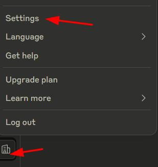
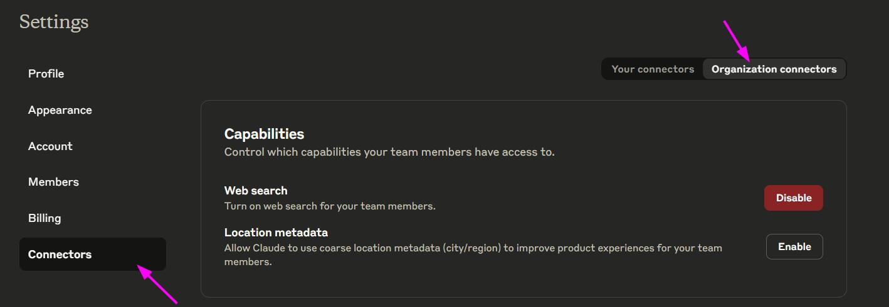
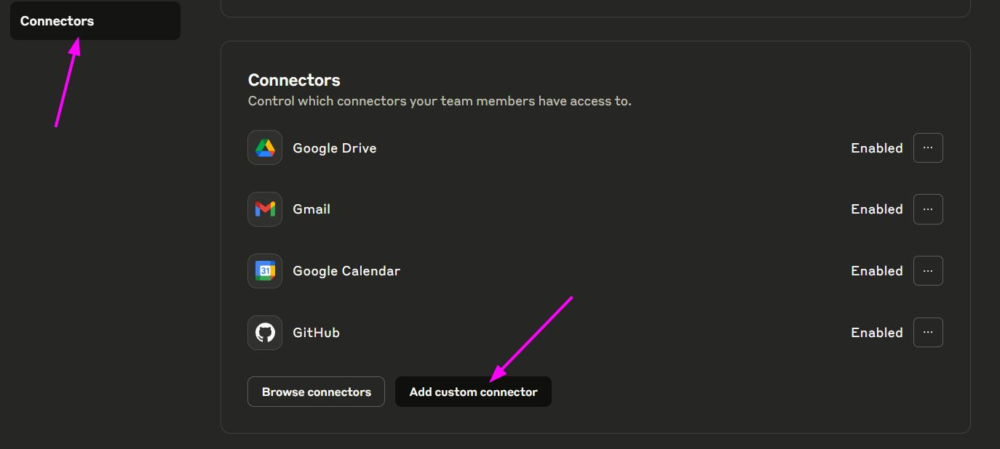
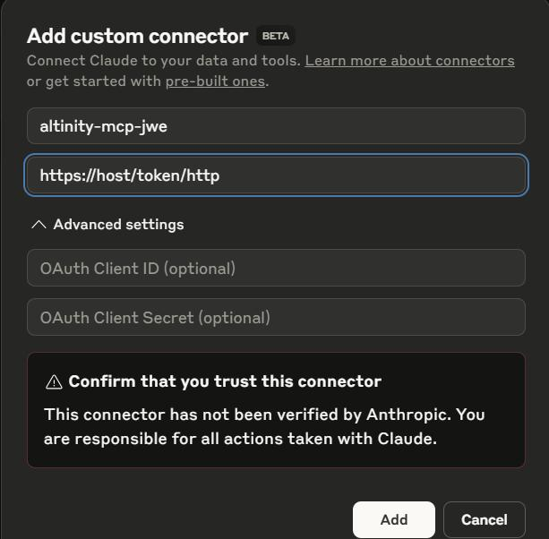
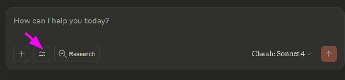
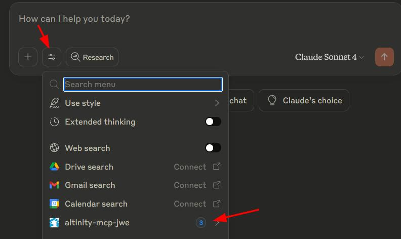
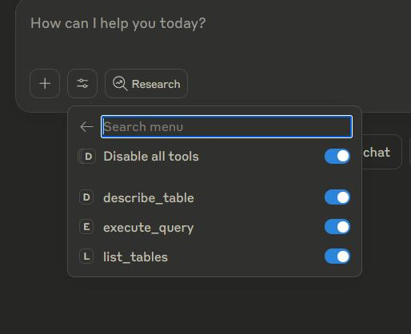
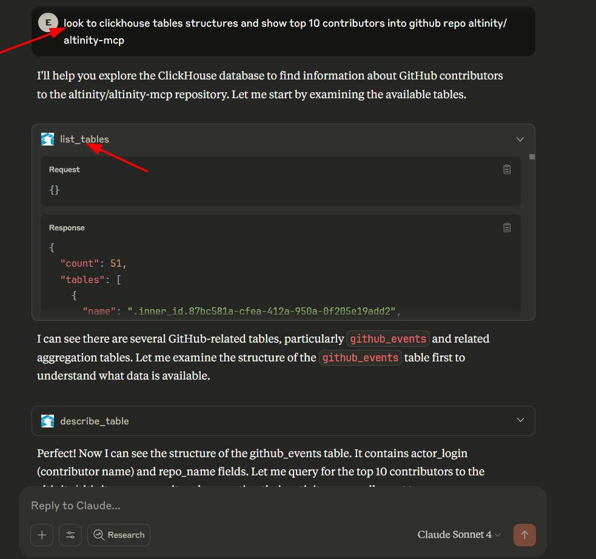

# How to Integrate Altinity MCP with AI Tools

This guide provides step-by-step instructions for integrating the Altinity MCP Server with various AI tools and platforms.

## Table of Contents

- [Install Helm Chart with Minikube and Helm from GHCR.io (Token Enabled)](#install-helm-chart-with-minikube-and-helm-from-ghcrio-token-enabled)
- [Generate Token from JWE Token Generator](#generate-token-from-jwe-token-generator)
- [Integrate with Claude.ai Chat Web Interface](#integrate-with-claudeai-chat-web-interface)
- [Integrate with OpenAI ChatGPT GPTs](#integrate-with-openai-chatgpt-gpts)
- [Integrate with Claude Desktop](#integrate-with-claude-desktop)
- [Integrate with Claude Code (Claude MCP)](#integrate-with-claude-code-claude-mcp)
- [Integrate with Cursor.com](#integrate-with-cursorcom)
- [Integrate with Windsurf](#integrate-with-windsurf)

## Install Helm Chart with Minikube and Helm from GHCR.io (Token Enabled)

To install the Altinity MCP Helm chart with token authentication enabled using Minikube:

1. First, ensure you have Minikube and Helm installed:
   ```bash
   minikube start
   helm version
   ```

2. Install the Altinity MCP Helm chart from GHCR.io with token authentication enabled:
   ```bash
   helm install altinity-mcp oci://ghcr.io/altinity/altinity-mcp/helm/altinity-mcp \
     --set config.server.jwe.enabled=true \
     --set config.server.jwe.jweSecretKey="your-jwe-secret-key" \
     --set config.server.jwe.jwtSecretKey="your-jwt-secret-key" \
     --set config.server.transport=http \
     --set config.server.port=8080
   ```

3. Forward the port to access the service:
   ```bash
   kubectl port-forward service/altinity-mcp 8080:8080
   ```

For detailed configuration options, see the [Helm Chart README](../helm/altinity-mcp/README.md).

## Generate Token from JWE Token Generator

To generate a JWE token for authentication using Docker:

```bash
docker run --rm ghcr.io/altinity/altinity-mcp:latest jwe-token-generator \
  --jwe-secret-key "your-jwe-secret-key" \
  --jwt-secret-key "your-jwt-secret-key" \
  --host "clickhouse.example.com" \
  --port 8123 \
  --database "analytics" \
  --username "user123" \
  --password "password123" \
  --expiry 86400
```

This will output a JWE token that can be used for authentication with the Altinity MCP server.

## Integrate with Claude.ai Chat Web Interface

To integrate Altinity MCP with Claude.ai:

1.  Navigate to [https://claude.ai](https://claude.ai) and log in to your account.
2.  Go to **Settings** > **Connectors**.
    
3.  In the **Connectors** settings, click on **Add custom connector**.
    
4.  Enter a name for your connector (e.g., `altinity-mcp-jwe`) and the server URL, which should include the JWE token. For example: `https://host/token/http`.
    
5.  After adding the connector, you can enable it for your chat session by clicking the tool icon.
    
6.  You can see the list of available tools and enable or disable them.
    
7.  Once enabled, you can use the tools in your chat. For example, you can ask Claude to list tables from your ClickHouse database.
    
8.  Claude will show the results from the tool execution.
    
9.  You can continue the conversation with Claude to analyze the data.
    

## Integrate with OpenAI ChatGPT GPTs

To integrate Altinity MCP with OpenAI GPTs:

1. Navigate to [https://chatgpt.com](https://chatgpt.com) and log in to your account
2. Create a new GPT or edit an existing one
3. In the configuration interface, go to the "Configure" tab
4. Scroll down to the "API endpoints" section
5. Add your Altinity MCP server as an API endpoint:
   
6. Configure the authentication with your JWE token:
   
7. Test the connection to ensure it's working properly:
   

## Integrate with Claude Desktop

To integrate Altinity MCP with Claude Desktop:

1. Open Claude Desktop application
2. Go to "Settings" (gear icon) in the bottom left corner
3. Select "Tools" from the settings menu
4. Click "Add Custom Tool"
5. Enter your Altinity MCP server details:
   
6. Configure the authentication with your JWE token:
   
7. Save the configuration and test the connection:
   

## Integrate with Claude Code (Claude MCP)

To integrate Altinity MCP with Claude Code (Claude MCP):

1. Open Claude Code application
2. Navigate to the "Tools" section
3. Select "Add MCP Tool"
4. Enter your Altinity MCP server endpoint:
   
5. Configure authentication with your JWE token
6. Save and test the integration

## Integrate with Cursor.com

To integrate Altinity MCP with Cursor.com:

1. Open Cursor.com IDE
2. Go to "Settings" (Ctrl/Cmd + ,)
3. Navigate to "Tools" or "MCP" section
4. Add a new MCP connection:
   
5. Enter your Altinity MCP server details
6. Configure authentication with your JWE token
7. Save and test the connection

## Integrate with Windsurf

To integrate Altinity MCP with Windsurf:

1. Open Windsurf IDE
2. Go to "Preferences" or "Settings"
3. Find the "Tools" or "MCP" section
4. Add a new MCP tool configuration:
   
5. Enter your Altinity MCP server endpoint
6. Configure authentication with your JWE token
7. Save and verify the connection

## Troubleshooting

If you encounter issues during integration:

1. Verify your Altinity MCP server is running and accessible
2. Ensure your JWE token is valid and not expired
3. Check that the server configuration matches the integration settings
4. Confirm network connectivity between the AI tool and your Altinity MCP server
5. Review server logs for authentication or connection errors

For more detailed troubleshooting, refer to the main [README.md](../README.md) file.
